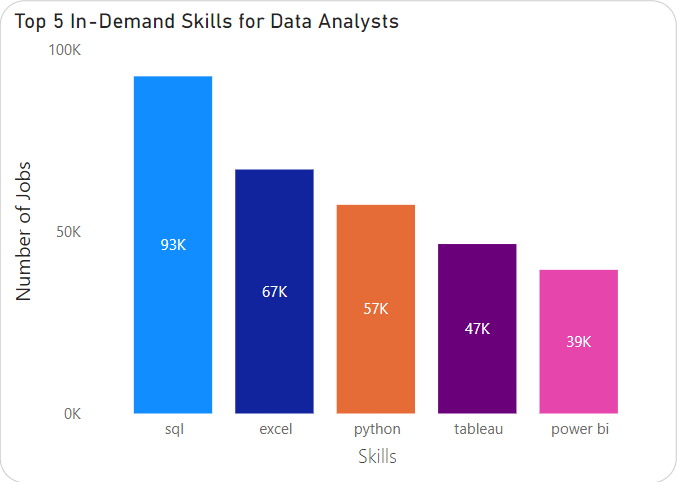

# Data-Jobs-Analysis

## Introduction 🌟

In today's dynamic job market, understanding the landscape of data-related roles is crucial for both job seekers and employers. This Data Analytics project delves into comprehensive data on job postings, aiming to unveil the intricacies of the data job market. By leveraging a robust dataset, we analyze various aspects such as top-paying jobs, in-demand skills, job trends across locations and time, and the most optimal skills for different data professions. This project serves as a valuable resource for anyone looking to navigate the competitive world of data jobs, offering insights that can guide career decisions and strategic hiring practices.

Want to look at the SQL queries🤔 Here you go : [SQL Queries](Queries)

## Objective 🎯

The primary objective of this project is to provide actionable insights into the data job market through detailed analysis of job postings. Specifically, we aim to:

1. **Identify Top Paying Jobs 💰**: Determine which companies offer the highest salaries for data-related roles.
2. **Highlight In-Demand Skills 🛠️**: Analyze which skills are most sought after in the industry and how they correlate with job categories like Data Analyst, Data Engineer, and Data Scientist.
3. **Track Job Trends 📈**: Explore how job availability and requirements have evolved over time and across different locations.
4. **Optimize Skill Development 🚀**: Identify the most optimal skills for job seekers to develop in order to enhance their employability and earning potential.

By achieving these objectives, our project aims to empower individuals and organizations with the knowledge needed to make informed decisions in the ever-evolving field of data analytics.

## Background:
This data has been collected from this source. [Data Source](https://www.lukebarousse.com/sql)📊

I've designed and implemented a relational database to store and analyze job posting data. The database is structured to provide insights into job trends, required skills, and salary information.
The project uses four primary tables to organize and analyze the data:

- **company_dim**: Contains details about companies, including company ID, name, and links.
- **skills_dim**: Stores information about skills, including skill ID, name, and type.
- **job_postings_fact**: Captures job postings data with fields such as job ID, company ID, job title, location, posted date, and salary information.
- **skills_job_dim**: A junction table linking jobs and skills with job ID and skill ID as foreign keys.

The relational database can be visualised using the table schemas below:

<div align="center">
    
</div>

## Tools I Used:

#### **SQL**
- **Role**: The backbone of the analysis
- **Usage**: Crafted and executed intricate queries to extract and analyze job market data, uncovering critical insights into top-paying jobs, essential skills, and job trends.

#### **PostgreSQL**
- **Role**: Database Management System
- **Usage**: Managed and queried the comprehensive job postings database, ensuring efficient data handling and retrieval.

#### **Visual Studio Code**
- **Role**: Integrated Development Environment (IDE)
- **Usage**: Streamlined database management and SQL query execution, enhancing productivity and precision in data analysis.

#### **Git & GitHub**
- **Role**: Version Control and Collaboration Platform
- **Usage**: Ensured seamless version control and collaboration by tracking changes, sharing SQL scripts, and managing the project through branches and pull requests.

---

This powerful toolkit enabled a thorough exploration of the data analyst job market, revealing key trends and insights with precision and clarity.


## The Analysis:

Each query has been aimed at answering a specific question related to the data job market. In many cases, I have focussed on mainly Data Analyst Remote jobs.

### 1. Top 20 Companies by Job Postings:

Top 20 Companies by Job Postings and Average Salaries: Identifies the leading companies with the most job listings and calculates their average offered salaries.

```sql
-- Finding top 10 companies with the most job postings and getting the average salaries being offered:
SELECT 
    name, 
    COUNT(*) AS num_jobs, 
    ROUND(AVG(salary_year_avg), 2) AS avg_salary
FROM job_postings_fact jpf
JOIN company_dim cd ON jpf.company_id = cd.company_id
GROUP BY jpf.company_id, name
ORDER BY num_jobs DESC
LIMIT 20;
```

***Analysis:***

Here's the breakdown of the top 20 companies by job postings and average salaries:

- **Top Employers:** "Emprego" and "Booz Allen Hamilton" lead in job postings, with 6,661 and 2,890 jobs respectively.
- **Highest Average Salaries:** "Capital One" offers the highest average salary at $189,214.09, followed by "Harnham" at $168,793.10.
- **Frequent Job Posters with No Salary Data:** Companies like "Emprego," "Confidenziale," "Listopro," and "Upwork" have high job postings but no provided salary data.
- **Major Employers with Competitive Salaries:** "Insight Global," "Citi," and "Accenture" have substantial job postings (over 1,700 each) and offer average salaries ranging from $113,786.07 to $124,904.52.

<div align="center">
    
</div>

### 2. Top 20 Companies for Data Analyst Positions: 
Focuses on companies with the highest number of job postings specifically for Data Analyst roles, along with their average salaries.


```sql
-- Specifically for Data Analysts:
SELECT 
    name, 
    COUNT(*) AS num_jobs, 
    ROUND(AVG(salary_year_avg), 2) AS avg_salary
FROM job_postings_fact jpf
JOIN company_dim cd ON jpf.company_id = cd.company_id
WHERE job_title_short='Data Analyst'
GROUP BY jpf.company_id, name
ORDER BY num_jobs DESC
LIMIT 20;
```

***Analysis:***
Here's the breakdown of the top 20 companies for Data Analyst positions and average salaries:

1. **Top Employers**: "Emprego" leads with 1,121 job postings, followed by "Robert Half" with 1,047 postings.
2. **Highest Average Salaries**: "Citi" offers the highest average salary at $121,509.39, significantly higher than others.
3. **Frequent Job Posters with No Salary Data**: Companies like "Emprego," "Confidenziale," "Tesla," "Peroptyx," and "S&P Global" have high job postings but no provided salary data.
4. **Prominent Employers with Competitive Salaries**: Companies like "Insight Global," "UnitedHealth Group," and "Accenture" have substantial job postings (over 300 each) with average salaries ranging from $92,801.35 to $115,000.
5. **Diverse Industry Representation**: The list includes staffing firms (e.g., "Robert Half," "Randstad"), consulting firms (e.g., "Booz Allen Hamilton," "Accenture"), tech companies (e.g., "Tesla," "S&P Global"), and financial institutions (e.g., "Citi," "UnitedHealth Group").

<div align="center">
    
</div>


### 3. Job Distribution by Category and Type: 
Analyzes the number of job postings based on job categories, schedule types, and work-from-home options.

```sql
-- Number of jobs based on job categories:
SELECT 
    job_title_short,
    job_schedule_type,
    job_work_from_home,
    COUNT(job_id) AS Number_Of_Jobs
FROM job_postings_fact
GROUP BY job_title_short, job_schedule_type, job_work_from_home
ORDER BY Number_Of_Jobs DESC;
```

***Analysis:***
Here's the breakdown of the job distribution based on job categories, schedule types, and work-from-home options:

1. **Most In-Demand Roles**: Data Analyst, Data Engineer, and Data Scientist are the most prevalent roles across all types of job schedules and work arrangements.

2. **Preference for Full-time Roles**: Full-time positions dominate across all job titles, indicating a strong preference for stable employment.

3. **Flexibility in Work Arrangements**: There is a notable presence of remote work options (work-from-home) particularly among Data Engineers and Data Scientists.

4. **Contract and Part-time Opportunities**: Contractual roles and part-time positions are available across various job titles, though they constitute a smaller proportion compared to full-time roles.

5. **Internship Opportunities**: Internships are available predominantly in Data Analyst and Data Scientist roles, suggesting a robust pipeline for entry-level professionals in these fields.

<div align="center">
    
</div>

### 4. Top Skills in Key Data Roles: 
Identifies the most commonly required skills for Data Analyst, Data Engineer, and Data Scientist positions and also shows th number of jobs associated with each skills.

```sql
WITH JobCategories AS (
    SELECT job_id,
        CASE
            WHEN job_title ILIKE '%data analyst%' THEN 'Data Analyst'
            WHEN job_title ILIKE '%data engineer%' THEN 'Data Engineer'
            WHEN job_title ILIKE '%data scientist%' THEN 'Data Scientist'
            ELSE 'Other'
        END AS job_category
    FROM public.job_postings_fact
)
SELECT 
    jc.job_category, 
    s.skills, 
    COUNT(*) AS num_jobs
FROM JobCategories jc
JOIN skills_job_dim sj ON jc.job_id = sj.job_id
JOIN skills_dim s ON sj.skill_id = s.skill_id
WHERE job_category NOT IN ('Other')
GROUP BY jc.job_category, s.skills
ORDER BY jc.job_category ASC, num_jobs DESC;
```

***Analysis:***
Here are the key insights from the dataset on job categories, skills, and number of job postings:

1. **Most In-Demand Skills**: Across all job categories (Data Analyst, Data Engineer, Data Scientist), **SQL** consistently appears as the top skill, indicating its critical importance in data-related roles.
   
2. **Data Analyst Specifics**: For Data Analysts, **SQL** is also the most in-demand skill, followed by **Excel**, **Python**, and **Tableau**. These skills reflect the foundational tools and programming languages necessary for data analysis and visualization.
   
3. **Data Engineer Specifics**: Data Engineers require skills in **SQL**, **Python**, **AWS**, **Azure**, and **Spark**. These skills are essential for managing and processing large datasets, setting up data pipelines, and cloud infrastructure management.
   
4. **Data Scientist Specifics**: Data Scientists prioritize **Python**, **SQL**, **R**, **Machine Learning frameworks (TensorFlow, PyTorch)**, and **Data Visualization tools (Tableau, Power BI)**. These skills highlight their role in developing predictive models, analyzing data, and deriving insights.
   
5. **Emerging Skills**: Some emerging skills across all roles include **PySpark**, **Git**, **Docker**, and **Machine Learning frameworks** like TensorFlow and PyTorch. These skills indicate the industry's shift towards big data processing, version control, containerization, and advanced analytics capabilities.

These insights summarize the critical skills demanded by each job category in the data field, highlighting commonalities and unique requirements across Data Analysts, Data Engineers, and Data Scientists.

<div align="center">
    
</div>

### 5.Top 20 Highest Paying Remote Data Analyst Jobs: 
Identifies the top 20 highest paying remote Data Analyst roles with specified salaries.

```sql
-- Top 20 Data Analyst Remote jobs:
SELECT 
    job_id,
    name AS company_name,
    job_title,
    job_location,
    job_schedule_type,
    salary_year_avg,
    job_posted_date::DATE
FROM
    job_postings_fact
LEFT JOIN company_dim ON company_dim.company_id = job_postings_fact.company_id
WHERE
    job_title_short = 'Data Analyst' 
    AND (job_location = 'Anywhere' OR job_work_from_home=TRUE)
    AND salary_year_avg IS NOT NULL
ORDER BY 
    salary_year_avg DESC
LIMIT 20;
```

***Analysis:***

Here are the key insights from the dataset on the top 20 highest paying remote Data Analyst roles with specified salaries and number of job postings:

1. **Salary Range**: Salaries for data-related roles vary significantly, with the highest reported at **$650,000** per year for a Data Analyst position.
   
2. **Job Titles**: Job titles range from specific roles like **Data Analyst** and **Director of Analytics** to more specialized positions such as **Principal Data Analyst** and **Director of Data Analytics**.
   
3. **Company Diversity**: Companies hiring for these roles include tech giants like **Meta (formerly Facebook)**, **AT&T**, **Pinterest**, **Uber**, and healthcare organizations like **Mayo Clinic** and **Cedars-Sinai**.
   
4. **Job Schedule**: Most positions are **full-time**, reflecting the industry's preference for dedicated roles in data analysis and management.
   
5. **Post Date**: Job postings span from **January** to **December 2023**, indicating ongoing demand throughout the year across various sectors and regions.

These points summarize the range of salaries, job titles, companies, schedule types, and posting dates observed in the dataset for data-related job opportunities.


### 6. Skills Required for High Paying Data Analyst Jobs: 
Lists the skills required for these top-paying Data Analyst positions, mentioned above.

```sql
-- Skills required in these high paying jobs:
WITH high_paying_jobs AS (
    SELECT 
        job_id,
        job_title,
        salary_year_avg
    FROM
        job_postings_fact
    LEFT JOIN company_dim ON company_dim.company_id = job_postings_fact.company_id
    WHERE
        job_title_short = 'Data Analyst' 
        AND (job_location = 'Anywhere' OR job_work_from_home=TRUE)
        AND salary_year_avg IS NOT NULL
    ORDER BY 
        salary_year_avg DESC
    LIMIT 20
)

SELECT 
    high_paying_jobs.*,
    skills
FROM 
    high_paying_jobs
JOIN skills_job_dim ON skills_job_dim.job_id = high_paying_jobs.job_id
JOIN skills_dim ON skills_dim.skill_id = skills_job_dim.skill_id
ORDER BY 
    salary_year_avg DESC;
```

***Analysis:***

Here are the key insights from the dataset on the skills required for the top Data Analyst roles as mentioned above:

1. **Skill Diversity**: Skills demanded include foundational tools like **SQL**, **Python**, **R**, **Excel**, and **Tableau** across various roles, indicating their critical importance in data analysis and management positions.

2. **Specialized Tools**: Advanced skills such as **Azure**, **AWS**, **Databricks**, **Power BI**, **Snowflake**, **Git**, **Jupyter**, **Pandas**, **NumPy**, **GitLab**, **Bitbucket**, **Atlassian suite (Jira, Confluence)**, and **Hadoop** are sought after, highlighting the need for expertise in cloud platforms, version control, and big data technologies.

3. **Industry-Specific Skills**: Specific industries require specialized knowledge, such as **Crystal** (likely Crystal Reports) in healthcare-related data roles and **Swift** (likely for mobile app analytics) in managerial positions.

4. **Management and Leadership Roles**: Higher-level positions like **Associate Director** and **Director** require a broad spectrum of skills spanning both technical (SQL, Python) and managerial (Excel, PowerPoint) competencies.

5. **Hybrid and Remote Roles**: There's a trend towards **hybrid** and **remote** job roles, accommodating flexibility in work arrangements, which is becoming increasingly important in the data analytics field.

These points summarize the diverse skill set requirements across different data-related job titles, reflecting both technical depth and industry-specific expertise demanded in the current job market.


### 7. Top 10 Skills for Remote Data Analyst Jobs (Based on Average Salary): 
Identifies the top 10 skills required for remote Data Analyst positions based on job postings and average salary.

```sql
-- Showing the top 10 skills required for data analyst remote jobs (Based on Average Salary):  
SELECT 
    s.skill_id, 
    s.skills, 
    COUNT(*) AS num_jobs,
    ROUND(AVG(salary_year_avg), 2) AS avg_salary
FROM skills_dim s
JOIN skills_job_dim sj ON s.skill_id = sj.skill_id
JOIN job_postings_fact jpf ON sj.job_id = jpf.job_id
WHERE 
    job_title_short = 'Data Analyst'
    AND (job_location = 'Anywhere' OR job_work_from_home=TRUE)
    AND salary_year_avg IS NOT NULL
GROUP BY s.skill_id, s.skills
ORDER BY avg_salary DESC
LIMIT 10;
```

***Analysis:***

Here, we look into the top 10 skills required for data analyst remote jobs based on job postings and average salary, in general, and found the following insights:

1. **High Demand Skills**: Skills like **Pyspark**, **Bitbucket**, **Jupyter**, and **Pandas** are in high demand, with multiple job openings (2-9 jobs) indicating their importance across various roles.

2. **Top Average Salaries**: Skills such as **Pyspark** and **Bitbucket** command the highest average salaries, with **Pyspark** at \$208,172.25 and **Bitbucket** at \$189,154.50, suggesting specialized expertise in these areas is highly valued.

3. **Emerging Skills**: Skills like **Couchbase**, **Watson**, and **Elasticsearch** are less common but offer competitive average salaries, reflecting niche expertise sought by specific industries or roles.

4. **Versatile Skills**: **Gitlab** and **Jupyter** are examples of skills demanded across a broader range of roles (3 jobs each) with solid average salaries (\$154,500 and \$152,776.50, respectively), indicating their versatility and importance in various data-related positions.

5. **Skill Impact on Salaries**: There's a significant variation in average salaries associated with different skills, emphasizing the direct correlation between specific technical competencies and earning potential in data-related fields.

These points highlight the importance of acquiring and mastering specific skills like Pyspark, Bitbucket, and Jupyter, which not only increase job prospects but also contribute to higher average salaries in the data analytics job market.

<div align="center">
    
</div>

### 8. Job Postings by Country: 
Determines the number of job postings available in each country.

```sql
-- Determining the number of job postings per country:
SELECT job_country, COUNT(*) AS num_jobs
FROM job_postings_fact
GROUP BY job_country
ORDER BY num_jobs DESC;
```

***Analysis:***

Here are the summarized findings regarding the number of job postings per country:

1. **United States**: Leads with the highest number of job postings, indicating a robust and diverse job market across various sectors.

2. **India**: Follows closely behind the United States, reflecting significant opportunities, particularly in technology and IT-related fields.

3. **United Kingdom, Canada, and Germany**: These countries also show substantial numbers of job postings, highlighting strong economic sectors and demand across diverse industries.

These points provide a snapshot of the distribution of job opportunities across key countries based on the dataset, emphasizing their respective strengths in employment sectors.
<div align="center">
    
</div>

### 9. Average Salary by Job Location: 
Calculates the average salary for job postings in various locations.

```sql
-- Finding the average salary based in each job location:
SELECT job_location, ROUND(AVG(salary_year_avg)) AS avg_salary
FROM job_postings_fact
WHERE salary_year_avg IS NOT NULL
GROUP BY job_location
ORDER BY avg_salary DESC
LIMIT 500;
```

***Analysis:***
Here's a concise summary of the observations based on job location and average salary:

1. **Global Disparities**: Salaries vary significantly across the globe, with Madison, SD and Pretoria, South Africa topping the list at \$960,000 and \$890,000 respectively, while other locations like Belarus and various U.S. cities show considerable range.

2. **Urban Influence**: Major urban centers like San Francisco, CA and New York, NY maintain high average salaries (\$246,509 and \$246,500 respectively), likely due to strong local economies and high living costs.

3. **Regional Economic Factors**: Differences in average salaries within countries highlight regional economic disparities, such as higher earnings in tech hubs like Silicon Valley versus other parts of California or the U.S., reflecting local industry strengths and economic conditions.

### 10. Top 5 In-Demand Skills for Data Analysts: 
Identifies the five most sought-after skills for Data Analyst positions based on the number of job postings.

```sql
SELECT 
    skills,
    COUNT(skills_job_dim.job_id) AS Number_Of_Jobs
FROM job_postings_fact
INNER JOIN skills_job_dim ON job_postings_fact.job_id = skills_job_dim.job_id
INNER JOIN skills_dim ON skills_job_dim.skill_id = skills_dim.skill_id
WHERE job_title_short = 'Data Analyst'
GROUP BY skills
ORDER BY Number_Of_Jobs DESC
LIMIT 5;
```

***Analysis:***

Here's a concise summary of the observations on skills and their respective number of jobs:

1. **SQL Dominance**: SQL stands out as the most in-demand skill with 92,628 job listings, reflecting its critical role in data management and analysis across various industries.

2. **Excel's Versatility**: Excel follows closely with 67,031 job listings, highlighting its enduring importance in data manipulation, reporting, and business analysis tasks.

3. **Python's Rising Demand**: Python shows significant popularity with 57,326 job listings, indicating its increasing relevance in data science, machine learning, and automation roles.

4. **Visualization Tools**: Tableau and Power BI are also prominent, with 46,554 and 39,468 job listings respectively, underscoring the demand for professionals skilled in data visualization and business intelligence.

5. **Tech Skills in High Demand**: Overall, these skills reflect a strong demand for technical proficiency in data handling, analysis, and visualization across various sectors, essential for roles ranging from data analysts to business intelligence developers.
<div align="center">
    
</div>


### 11. Top 25 Skills for Remote Data Analyst Jobs: 
Identifies the top 25 skills for remote Data Analyst positions, ranked by job frequency and average yearly salary.


```sql
SELECT
    skills,
    COUNT(job_postings_fact.job_id) AS Number_of_Jobs,
    ROUND(AVG(salary_year_avg), 2) AS Average_Yearly_Salary
FROM
    job_postings_fact
JOIN skills_job_dim ON skills_job_dim.job_id = job_postings_fact.job_id
JOIN skills_dim ON skills_dim.skill_id = skills_job_dim.skill_id
WHERE 
    salary_year_avg IS NOT NULL AND
    job_title_short = 'Data Analyst'
    AND  job_work_from_home = TRUE
GROUP BY
    skills_job_dim.skill_id, skills
ORDER BY
    Number_of_Jobs DESC, 
    Average_Yearly_Salary DESC
LIMIT 25;
```

***Analysis:***

Here's a concise summary of the observations on skills and their respective job frequency and average yearly salary:

1. **SQL Dominance**: SQL remains foundational for data analysis roles, indicating a persistent demand for professionals who can manage and query databases efficiently.

2. **Python's Versatility**: Python's high average salary despite being third in job frequency suggests its essential role in complex data analysis, automation, and scripting tasks.

3. **Visualization Tools**: Tableau and Power BI are crucial for data visualization, indicating a growing emphasis on presenting data insights effectively across remote work environments.

4. **Cloud Computing**: Skills like Snowflake, Azure, and AWS highlight a shift towards cloud-based data storage and analysis solutions, reflecting industry adoption of scalable and accessible data platforms.

5. **Programming Languages**: Beyond Python, R, Go, and JavaScript cater to specific analytical needs, showing a trend towards specialized programming skills tailored to different aspects of data analysis and application development.

These trends collectively depict a landscape where foundational skills like SQL are complemented by versatile programming languages, advanced visualization tools, and cloud technologies, reflecting the evolving demands and capabilities within remote Data Analyst roles.

### 12. Monthly Job Posting Trends: 
Tracks the monthly trend of job postings, indicating increases or decreases compared to the previous month.

```sql
-- Tracking the monthly trend of job postings, indicating whether it has increased or decreased compared to the previous month.
WITH MonthlyJobPostings AS 
(
    SELECT DATE_TRUNC('month', job_posted_date)::DATE AS month_start,
           COUNT(*) AS num_jobs
    FROM public.job_postings_fact
    GROUP BY month_start
    ORDER BY month_start
)
SELECT month_start,
    num_jobs,
    LAG(num_jobs) OVER (ORDER BY month_start) AS previous_month_jobs,
    CASE
        WHEN num_jobs > LAG(num_jobs) OVER (ORDER BY month_start) THEN 'Increase'
        WHEN num_jobs < LAG(num_jobs) OVER (ORDER BY month_start) THEN 'Decrease'
        ELSE 'No Change'
    END AS trend
FROM MonthlyJobPostings;
```


***Analysis:***
Based on the 2022 and 2023 job market data, the following obervations can be made:
Here's a more concise summary of the underlying trend in job postings and hiring throughout the observed year:

1. **Seasonal Variations**: Job postings typically fluctuated throughout the year, with noticeable peaks in January and August, possibly reflecting seasonal trends or periods of increased hiring activity.

2. **Mid-Year Recovery**: Following a decline from February to May, there was a steady recovery in job postings starting from June, indicating a rebound in demand and economic activity.

3. **End-of-Year Contraction**: Towards the end of the year, particularly in December, job postings tended to decline, suggesting a seasonal downturn or reduced hiring activity as the year concluded.

Overall, the year showed a pattern of initial stability, followed by fluctuations with periods of growth and decline in job postings. The mid-year recovery stood out as a significant trend, indicating resilience and adjustment in the job market throughout the observed period.

<div align="center">
    
</div>

### 13. Skill Demand Trends Over Time: 
Analyzes the yearly changes in demand for specific skills by comparing the number of job postings mentioning those skills.

```sql
/*
Analyzing the change in demand for specific skills over time by comparing the number of job
postings mentioning those skills each month:
*/ 

WITH SkillTrend AS (
    SELECT 
        s.skills,
        DATE_TRUNC('year', job_posted_date)::DATE AS posting_year,
        COUNT(*) AS num_jobs
    FROM job_postings_fact jf
    JOIN skills_job_dim sj ON jf.job_id = sj.job_id
    JOIN skills_dim s ON sj.skill_id = s.skill_id
    GROUP BY s.skills, posting_year
)
SELECT 
    skills, 
    posting_year,
    num_jobs,
    LAG(num_jobs) OVER (PARTITION BY skills ORDER BY posting_year) AS previous_year_jobs,
    CASE
        WHEN num_jobs > LAG(num_jobs) OVER (PARTITION BY skills ORDER BY posting_year) THEN 'Increase'
        WHEN num_jobs < LAG(num_jobs) OVER (PARTITION BY skills ORDER BY posting_year) THEN 'Decrease'
        ELSE 'No Change'
    END AS trend
FROM SkillTrend
ORDER BY skills, posting_year;
```

***Analysis:***

After analysing the yearly changes in demand for specific skills, the following observations can be made:

1. **Python and SQL Dominate**: Python and SQL show significant growth across the years, reflecting their importance in various domains such as data analysis, machine learning, and database management.

2. **Cloud Technologies Surge**: Technologies related to cloud computing, such as AWS, Azure, Google Cloud Platform (GCP), and Kubernetes, have experienced substantial increases. This aligns with the broader adoption of cloud solutions in enterprise and development environments.

3. **Data Analytics and Visualization**: Tools like Excel, Power BI, Tableau, and matplotlib have seen notable upticks, indicating the growing importance of data analytics and visualization skills in modern workplaces.

4. **Web Development Frameworks**: Frameworks like React.js, Angular, Flask, and Django have shown growth, highlighting the ongoing demand for web development skills across different frameworks and libraries.

5. **Machine Learning and AI**: Technologies such as TensorFlow, PyTorch, and scikit-learn demonstrate increasing interest and adoption in machine learning and artificial intelligence applications, reflecting the trend towards automation and data-driven decision-making.

These points summarize the trends observed across various technologies based on their job postings over the years, indicating the evolving landscape of skills in the tech industry.


## Conclusions: 🎉 Decoding the Data Job Market Trends

The analysis of job postings and skill requirements in the data analytics field reveals several compelling insights and trends that aspiring data analysts should heed:

1. **Rise of Python and SQL**: Python and SQL emerge as foundational skills across all data-related roles, underscoring their indispensability in data management, analysis, and automation. Aspiring analysts should prioritize mastering these languages to enhance employability.

2. **Cloud Computing Dominance**: The surge in AWS, Azure, and GCP reflects a paradigm shift towards cloud-based data solutions. Acquiring skills in cloud platforms and Kubernetes can significantly boost career prospects, aligning with industry demands for scalable and flexible data infrastructure.

3. **Visualization and Analytics Tools**: Proficiency in tools like Tableau, Power BI, and Excel remains crucial for data analysts, facilitating effective data visualization and actionable insights. Aspiring analysts should invest time in mastering these tools to excel in data presentation and decision support roles.

4. **Machine Learning and AI**: The integration of TensorFlow, PyTorch, and scikit-learn highlights the growing application of AI and machine learning in data analytics. Professionals aiming for advanced roles should develop expertise in these frameworks to harness predictive analytics and data-driven innovations.

5. **Diverse Industry Opportunities**: The data job market spans diverse sectors, including tech, finance, healthcare, and consulting. Tailoring skills to specific industry needs—such as healthcare analytics or financial modeling—can open doors to specialized and high-paying roles.

6. **Remote Work and Flexibility**: The prevalence of remote work options indicates a shift towards flexible work arrangements. Embracing remote collaboration tools and demonstrating adaptability to virtual environments can enhance job market competitiveness.

7. **Top-Paying Data Analyst Jobs:** The highest-paying jobs for data analysts that allow remote work offer a wide range of salaries, the highest at $650,000! Specialized skills, such as SVN and Solidity, are associated with the highest average salaries, indicating a premium on niche expertise.

**Actions for Aspiring Data Analysts**:
- **Skill Development**: Focus on mastering Python, SQL, cloud platforms (AWS, Azure), and visualization tools (Tableau, Power BI).
- **Continuous Learning**: Stay updated with emerging technologies like machine learning frameworks (TensorFlow, PyTorch) and advancements in data analytics.
- **Industry Specialization**: Explore opportunities in high-growth industries like healthcare, finance, and tech by acquiring industry-specific knowledge and certifications.
- **Adaptability and Remote Readiness**: Prepare for remote work by honing communication skills, virtual collaboration, and proficiency in remote work tools.

In conclusion, the data analytics landscape presents abundant opportunities for those equipped with the right skills and industry knowledge. By focusing on core technical competencies, staying abreast of industry trends, and embracing flexibility, aspiring data analysts can navigate the evolving job market and thrive in their careers.

### References:

The dataset was obtained from the SQL Course by Luke Barousse.
